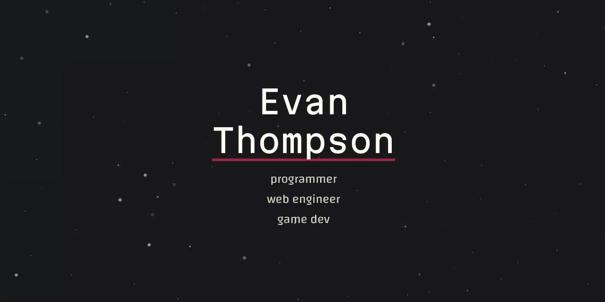

<h2>
  Tanadon Chaisila
</h2>

---

  <small>
    
      นักศึกษาวิทยาการคอมพิวเตอร์ มหาวิทยาลัยขอนแก่น ที่สนใจด้าน <b>Data Engineering</b>, 
      <b>Data Analytics</b> และ <b>Machine Learning</b> 
      มีประสบการณ์ในการใช้ Python, SQL, PostgreSQL, MySQL และ Supabase 
      รวมถึงการพัฒนาแอปพลิเคชันที่ขับเคลื่อนด้วยข้อมูล 
      สนใจการออกแบบ Data Pipeline การจัดการฐานข้อมูล การประมวลผลข้อมูล 
      และการนำข้อมูลดิบมาสร้างเป็นข้อมูลเชิงลึกที่มีประโยชน์
    
  </small>

---

GitHub Stats

   

  

---

Tech Stack

  
  
  
  
  
  
    

  
  
  
  
  
    

  
  
  
  
    

  
  
  
    

  
  

---

 <i>“เขียนโค้ด เรียนรู้ สร้าง และพัฒนา”</i> 

 ⭐ ขอบคุณที่เข้ามาเยี่ยมชมโปรไฟล์ของผมครับ! 

